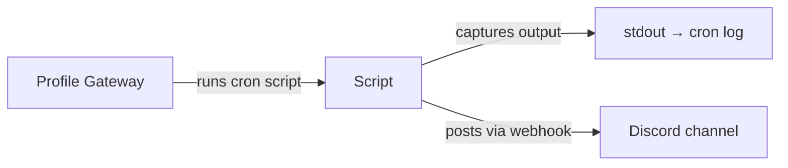

# Cron Job Management

This skill covers the full lifecycle of Hermes cron jobs: creation, inspection, backup/recreation from summaries, and maintaining the supporting script infrastructure.

## Scope

- **Creating cron jobs** via `cronjob` tool and `hermes cron` CLI
- **Inspecting existing jobs** — list, view details, check status
- **Recreating jobs from backup** — when `jobs.json` is missing but you have a summary
- **Script infrastructure** — creating/maintaining scripts in `~/.hermes/scripts/` and `/opt/...`
- **Job types** — agent-based (prompt), script-only (`no_agent=true`), watchdog patterns

## Key Concepts

### Job Storage
- Jobs stored in `~/.hermes/cron/jobs.json` (per-profile — the `cronjob` tool only reads/writes the **current profile's** DB)
- Output saved to `~/.hermes/cron/output/{job_id}/{timestamp}.md`
- Scheduler heartbeat: `~/.hermes/cron/ticker_heartbeat` and `ticker_last_success`
- **Source of truth**: `cronjob list` shows the current profile's jobs; for any other profile read `~/.hermes/profiles/<name>/cron/jobs.json` directly

### Two Creation Interfaces

**1. `cronjob` tool (programmatic, rich options):**
```python
cronjob("create", {
    "name": "JOB-NAME",
    "schedule": "every 90 minutes",
    "prompt": "Task instruction for the agent",
    "deliver": "origin",  # or "local", "telegram", etc.
    "toolsets": ["terminal", "file", "search"],
    "provider": "opencode-go",
    "model": "mimo-v2.5",
    "no_agent": False,  # default
    "script": "script-name.py",  # optional, for data collection
})
```

**2. `hermes cron create` CLI (simpler, interactive):**
```bash
hermes cron create "0 4 * * *" "cd /opt/firecrawl && python3 post_blog.py" \
  --name "DAILY-FONEWORLD-BLOG" --deliver origin
```

### Job Types

| Type | `no_agent` | `script` | `prompt` | Use Case |
|------|------------|----------|----------|----------|
| Agent-based | false | optional | required | Complex reasoning, multi-step tasks |
| Script-only | true | required | empty | Watchdogs, health checks, simple side-effects |
| Hybrid | false | required | required | Agent runs, script provides context data |

### Schedule Formats

| Format | Example | Meaning |
|--------|---------|---------|
| Cron expression | `0 4 * * *` | Daily at 04:00 UTC |
| Cron with multiple times | `0 5,13,21 * * *` | 3x daily at 05:00, 13:00, 21:00 |
| Interval | `every 90 minutes` | Recurring every 90 min |
| Duration (one-shot) | `30m`, `2h`, `1d` | Run once after duration |
| ISO timestamp | `2026-07-01T04:00:00` | Run once at specific time |

## Recreating Jobs from Summary

When `jobs.json` is missing but you have a summary document (like the cron-summary.txt in this session):

1. **Parse the summary** for each job's: name, ID, schedule, command/script, delivery, type
2. **Create missing directories**: `/opt/firecrawl/`, `~/.hermes/scripts/`
3. **Recreate supporting scripts** from the "What it does" descriptions
4. **Create cron jobs** using appropriate interface for each type
5. **Test each script** before scheduling

### Script Templates

See `templates/` directory for starter scripts:
- `watchdog.py` — script-only health check watchdog
- `docker-watchdog.py` — Docker container crash watchdog (auto-restart exited containers)
- `agent-task.py` — agent-based task with gh/cli operations
- `blog-poster.py` — Firecrawl blog posting
- `health-check.py` — System health monitoring

## Key Lessons from Recreation (2026-06-30)

When recreating cron jobs from a summary document with missing `jobs.json`:

1. **Firecrawl v2 API**: Use `app.scrape(url, formats=['markdown'], only_main_content=True)` not `scrape_url(url, params={...})`
2. **Load `.env` in scripts**: All Python scripts must call `load_dotenv('/root/.hermes/.env')` at startup
3. **Script paths**: Use relative filename only (`script.py`) for `--script` parameter
4. **Watchdog pattern**: `no_agent=true` requires `--script` only; empty stdout = silent OK; exit 1 = alert
5. **PR Tracker**: Python > Bash for JSON state handling (avoids subshell array issues)
6. **Duplicate check**: Always `cronjob list` before creating; remove duplicates with `cronjob remove`
7. **Discord webhooks**: Single webhook URL can serve multiple jobs via different env var names
8. **Interfaces**: `cronjob create` for agent jobs (toolsets, model, provider); `hermes cron create` for simple script jobs
9. **Verification**: Test each script manually before scheduling; check `~/.hermes/cron/output/<job_id>/`

## Model Pinning and Provider Drift (2026-06-30)

A recurring failure mode is **inference config drift**. If a cron job is created without explicit provider/model, a later global provider change can cause "Skipped to prevent unintended spend". The fix is to pin each autonomous job to its intended model/provider pair.

Recommended solution:
- Pin automation jobs to their intended free code model (`north-mini-code-free` via `opencode-zen`) or their original intent.
- Keep the main/provider config changes separate from job-level execution constraints.
- Verify with `cronjob list` after pinning; then rerun to confirm execution_success instead of scheduling only.

## Backup-Driven Script Restoration (2026-06-30)

When a backup tarball contains an older `~/.hermes` tree, the fastest path is to inspect and extract **only the scripts and config** needed for failing cron jobs, e.g. `/home/ubuntu/hermes-essential-backup-*.tar.gz`.

Targeted restore pattern:
1. `mkdir -p /tmp/old-hermes && tar -xzf /path/backup.tar.gz -C /tmp/old-hermes`
2. Diff only `scripts/*`, `skills/devops/automated-background-jobs/scripts/*`, and relevant `cron/jobs.json` prompts/config.
3. Copy missing scripts into `~/.hermes/scripts/` and restore any helper like `post-pr-webhook.sh`.
4. Patch cron prompts to reference the restored files exactly.

## OpenFix PR Loop Pattern (2026-06-30)

For an auto-fix-bugs style job backed by the old pipeline (`auto-fix-bugs.py` + `post-pr-webhook.sh`):

- Restore scripts directly from backup when missing.
- Run it as an **agent job** (`no_agent=false`) with `script="auto-fix-bugs.py"`; the script is only the candidate fetcher. If `no_agent=true`, the job will only dump ISSUE_* markers and will not actually patch/push/open PRs.
- Pin the cron to the intended working code model/provider so it doesn’t get blocked by global provider drift (e.g. `openai-codex/gpt-5.5` when that credential pool is healthy; avoid stale OpenRouter/Nous pins that return HTTP 401).
- Set `workdir` to the actual repo checkout (`/usr/local/lib/hermes-agent` in the restored automation environment), not `~/.hermes/scripts`.
- Make the prompt explicitly drive the loop: script first, then branch/patch/commit/push/PR/webhook/tracker/return-to-main.
- Use only POSTed JSON or a helper script for Discord; no inline `curl`.
- Verification is not `execution_success`: inspect output files, log tail, git state, GitHub PR state, webhook HTTP status, and tracker JSON to know whether PRs/webhooks really happened.

### Parallel Fix Pattern (2026-07-07)

When fixing up to 10 distinct bugs in one run, **do not fix them sequentially** - use `delegate_task` to parallelize. The pattern:

1. **Dispatch parallel subagents** - group fixable issues into batches of up to 3 (limited by `delegation.max_concurrent_children` in config.yaml, default 3). Each subagent works on one issue independently: patches, commits, pushes, creates the PR, and posts to the Discord webhook.
2. **Check subagent results** - subagents are self-reporting. After dispatch, verify by:
   - `git branch -a | grep fix/<issue-num>` - branch exists?
   - `gh pr list --repo <repo> --head fix/<issue-num>` - PR was created?
3. **Handle max_concurrent_children limit** - if you have 4+ issues, send the first 3, wait for them to report back, then send the next batch. Do NOT attempt to send more than 3 at once; the API rejects with an error message about `max_concurrent_children`.
4. **Each subagent owns its lifecycle** - each receives: the repo path, the issue details, the GH auth, and the Discord webhook URL. Each independently: checks out main, creates branch, patches, commits, pushes, opens PR, posts webhook.
5. **Avoid branch collisions** - each subagent uses a unique branch name per issue (e.g. `fix/<issue-num>-<short-description>`). Never share branches between subagents.
6. **Subagent with no output = no fix** - if a subagent returns with no commit or PR visible in the repo, the fix likely failed silently. Re-try that issue directly.

```python
# Dispatch pattern:
delegate_task(tasks=[
    {"goal": "Fix issue #60272 ...", "context": "REPO=/tmp/agent ..."},
    {"goal": "Fix issue #59591 ...", "context": "REPO=/tmp/agent ..."},
    {"goal": "Fix issue #59594 ...", "context": "REPO=/tmp/agent ..."},
])
# Each subagent independently branches, commits, pushes, creates PR, posts webhook.
```

## Real Verification Checklist

After updating a cron job:
1. **Inspect output files**: `~/.hermes/cron/output/<job_id>/<timestamp>.md`
2. **Inspect logs**: `~/.hermes/logs/agent.log`
3. **Check repo state**: `git status`, `git branch -a`, `git log -2`
4. **Check PR list**: `gh pr list --author <user>` to confirm PR webhook flow actually happened
5. **Inspect tracker**: `~/.hermes/auto-fix-tracker.json`
6. **Don’t rely on `execution_success` alone** — it only means the agent returned without throwing; "[SILENT]" means delivery was skipped and no output was produced.

## Cron Delivery Hygiene

### Avoid Double-Delivery

A script that **both** posts to a webhook (Discord/Slack) **and** returns output that the cron agent delivers sends the same report twice. Users perceive this as noise/spam.

**Fix one of:**
1. **Script-only delivery** — set cron `deliver: "local"`, let the script handle all external delivery via its webhook
2. **Cron-only delivery** — remove the webhook call from the script, let the cron agent's final response be the sole delivery. Script should only gather data and print to stdout.
3. **If script must post to webhook** — suppress debug output showing raw HTTP status codes. The cron agent should not see `"Discord: 204"` in its input context.

### Strip Debug Output from Scripts

Scripts in hybrid mode (`no_agent=false` with `script=`) have their stdout injected into the cron agent's prompt. **Every printed line costs tokens and shapes the response.**

**Rules:**
- **Print data, not transport status.** `print("Discord: 204")` is a transport detail that becomes part of the agent's output — use `logging.debug()` or redirect to stderr.
- **No progress lines in stdout.** "Fetching financials..." belongs on stderr: `print("fetching...", file=sys.stderr)`.
- **No raw HTTP response codes in the user-facing response.** User should see metrics, not "HTTP 204".

```python
# BAD — debug output bleeds into cron agent's context
print("Fetching financials (1d)...")
resp = session.get(url)
print(f"   Discord: {resp.status_code}")  # User sees "Discord: 204"

# GOOD — debug to stderr, only results to stdout
import sys
print("Fetching financials (1d)...", file=sys.stderr)
resp = session.get(url)
# Don't print transport status at all
print(json.dumps({"leads": leads, "spend": spend}))
```

### Use [SILENT] for No-Op Runs

Configure the prompt to return exactly `[SILENT]` when there's nothing new to report — suppresses delivery entirely:

### Key Lessons from WordPress Blog Posting (2026-06-30)

When setting up automated blog posting to WordPress sites:

1. **WordPress REST API**: Use Application Passwords for authentication (`base64.b64encode(f"{user}:{app_password}")`)
2. **GPT Image mini (gpt-image-1)**: Cheapest image generation model - use `quality: "low"` for cost optimization
3. **Image upload flow**: Generate → base64 decode → upload to `/wp-json/wp/v2/media` → get media ID → create post with `featured_media`
4. **Topic rotation**: Use `day_of_year % len(topics)` for consistent daily rotation without external state
5. **Exact format matching**: Study existing posts via `/wp-json/wp/v2/posts` to replicate HTML structure, categories, tags
6. **Categories/Tags**: Fetch once from `/wp-json/wp/v2/categories` and `/wp-json/wp/v2/tags` - use IDs not names
6. **Image dimensions**: 1536x1024 matches WordPress featured image requirements
7. **Date formatting**: Use ISO 8601 (`%Y-%m-%dT%H:%M:%S`) for WordPress post dates
8. **Content structure**: Match the exact HTML classes and wrapper divs from existing posts

### Key Lessons from OpenCode Free Models (2026-06-30)

When choosing models for automated coding tasks on the OpenCode provider:

1. **Free model list**: Use `models.dev/api.json` → `opencode` provider → filter by `cost.input=0` AND `cost.output=0`
2. **Best free code model**: `north-mini-code-free` — specifically trained for code, 256K context, reasoning=true, tools=true, vision=false, $0 cost
4. **Free model alternatives**: `mimo-v2-pro-free` (1M ctx, vision), `nemotron-3-ultra-free` (1M ctx), `ring-2.6-1t-free` (262K), `kimi-k2.5-free` (262K, vision), `minimax-m3-free` (204K), `deepseek-v4-flash-free` (200K), `grok-code` (256K, vision)
5. **Provider selection**: Use `opencode` provider (not `opencode-go`) with free models; `opencode-go` requires paid models like `mimo-v2.5`
6. **Model selection for bug fixing**: Prioritize code-specialized free models (`north-mini-code-free`, `grok-code`) over generalist models

## Key Lessons from Cron Job Reliability Fixes (2026-07)

### Fix for preview-file.tsx Crash When Handling Binary Files
- **Issue**: File browser sidebar crashes with "NoneType object has no attribute 'splitlines'" when encountering binary files (.pdf, .xls, .pptx)
- **Root Cause**: 
  - `readDesktopFileText` in `web_server.py` returns `null` or a string for binary files instead of the expected object
  - `readTextPreview` function in `apps/desktop/src/app/chat/right-rail/preview-file.tsx` lacked null/string checks before calling `.splitlines()`
- **Fix**: Modified `readTextPreview` to properly handle null/string results:
  ```typescript
  async function readTextPreview(filePath: string) {
    try {
      const result = await readDesktopFileText(filePath)
      // If the result is null or a string, convert it to the expected object.
      if (result === null || typeof result === 'string') {
        const text = result === null ? '' : result;
        return {
          binary: false,
          byteSize: 0,
          language: 'text',
          mimeType: 'text/plain',
          path: filePath,
          text: text,
          truncated: false
        };
      }
      return result;
    } catch (error) {
      // Error handling...
    }
  }
  ```
- **Relevance to Cron Jobs**: Prevents desktop-related cron jobs from failing due to UI crashes when processing folders containing binary attachments

### Prevention of Unbounded Serve Processes
- **Issue**: Hermes Desktop spawns unbounded serve processes on reconnection (GitHub issue #58619)
- **Root Cause**: 
  - `hermes_cli.main serve` command lacks `--replace` flag to terminate existing processes
  - Desktop's reconnection logic spawns new serve processes without terminating old ones
  - With sustained model API errors, processes accumulate at ~1 per 15-30 minutes
- **Fix**: 
  - Added `--replace` argument to `serve_parser` in `hermes_cli/subcommands/dashboard.py`
  - Implemented `_kill_stale_serve_processes()` function to terminate existing serve processes before starting new ones
  - Added check in `cmd_dashboard` function to invoke kill logic when `--replace` flag is used
- **Relevance to Cron Jobs**: Prevents resource exhaustion in cron jobs that spawn `hermes serve` processes, ensuring clean process lifecycle management

## Periodic Audit and Cleanup

Over time, cron jobs accumulate. Common sources of bloat:
- **Test/experiment jobs** left behind after debugging (e.g. jobs named `w` running `echo hi`, or one-shot test claims)
- **Duplicate creations** from running `cronjob create` or `hermes cron create` for the same purpose more than once (e.g. 6 copies of a "claim job")
- **Orphaned entries** whose supporting scripts or repos no longer exist

Without periodic cleanup, the roster can grow to 15+ entries when only 4–5 are actually needed. The scheduler handles many gracefully, but each run still starts a session — wasted compute.

### Audit Procedure

Run periodically (weekly or monthly):

```bash
hermes cron list
```

Look for:
1. **Duplicate names** — jobs sharing the same name are duplicates created accidentally
2. **Jobs named `w`** — common leftover from debugging/experimentation (often just `echo hi`)
3. **Jobs named `claim job`** — test/experiment leftovers from claim-mechanic experiments
4. **One-shot jobs past their scheduled time** — stale, no longer needed
5. **Jobs whose purpose you don't recognize** — if you can't tell what it does, it's probably dead

### Cleanup Commands

Remove a single duplicate by job ID:

```bash
hermes cron remove <job_id>
```

**⚠️ Pitfall: Truncated `hermes cron list` output.** When the roster exceeds ~15 entries, the CLI list output is truncated, showing incomplete or unreliable job IDs. Attempting to remove jobs using IDs from a truncated listing causes "Job not found" errors for entries whose IDs were misrendered. Always verify against the source of truth.

For batch cleanup, the most reliable approach is to parse `~/.hermes/cron/jobs.json` directly — this avoids CLI truncation and gives you the real IDs:

```python
from hermes_tools import terminal
import json, os

with open(os.path.expanduser("~/.hermes/cron/jobs.json")) as f:
    data = json.load(f)

# Group jobs by name, keep first, flag duplicates
seen = {}
to_remove = []
for j in data["jobs"]:
    name = j["name"]
    if name in seen:
        to_remove.append(j["id"])
        print(f"Duplicate: {name} ({j['id']})")
    else:
        seen[name] = j["id"]

for jid in to_remove:
    result = terminal(f"hermes cron remove {jid} 2>&1")
    print(result["output"])
```

An older approach (less reliable when the list is long, since the underlying `hermes cron list` may truncate) is to hardcode known waste IDs from a prior listing:

```python
from hermes_tools import terminal

# Gather job IDs by known waste categories
w_jobs = ["f0efa9bdc3c1", "148b03a36bca"]  # "w" (every 5m, echo hi)
claim_dupes = ["e600dfd18fc6", "7541ecbe3649"]  # "claim job" — keep 1
paused = ["2e606471218d", "8237592e54f0"]  # "paused job" orphans
oneshot = ["bb2bd232c13c"]  # expired one-shots

all_to_remove = w_jobs + claim_dupes + paused + oneshot
for jid in all_to_remove:
    terminal(f"hermes cron remove {jid} 2>&1")
```

This hardcoded-ID method fails when the list output is incomplete. Prefer the `jobs.json` approach above for reliable batch cleanup.

### Prevention

- **Name jobs uniquely and descriptively** — never name a job `w` or `test`. A job named `CRM-HEALTH-REPORT` is much harder to accidentally duplicate than one named `w`.
- **Check before creating**: always run `hermes cron list` first to verify the purpose isn't already covered.
- **Delete experiment jobs immediately** after the experiment is done. A 30-second cleanup saves future confusion.

### Post-Cleanup: Output Directory Cleanup

After removing jobs, their output directories and standalone output files in `~/.hermes/cron/output/` are not automatically pruned. Clean them up to avoid confusion:

```bash
cd ~/.hermes/cron/output
# Identify stale directories (job IDs not in the current roster)
rm -rf <stale_job_id_1> <stale_job_id_2>
# Remove standalone output files (.txt) for removed jobs
rm -f <stale_timestamp_file_1>.txt
```

Only retain directories matching current active job IDs, plus their `.txt` output history files.

### Post-Cleanup: Health Verification

After cleanup, verify the remaining roster is healthy:

```bash
hermes cron list               # Confirm expected jobs remain
hermes cron status             # Scheduler is running
```

Also check each remaining job's last status from `~/.hermes/cron/jobs.json`:

```python
import json
with open("~/.hermes/cron/jobs.json") as f:
    jobs = json.load(f)["jobs"]
for j in jobs:
    print(j["id"], j["name"], j.get("last_status"), j.get("last_error"))
```

All active jobs should show `last_status: ok` and `last_error: None`. Jobs that never ran (no `last_run_at`) are fine if their schedule is in the future.

## Critical Fixes Applied

### Script Path Requirements
- Scripts MUST be in `~/.hermes/scripts/`
- Use **relative filename only** (`script.py`), not absolute or `~/` paths
- Scripts must be executable (`chmod +x`)

### Delivery Targets
- `origin` — delivers to the chat where job was created (Discord DM, Telegram, etc.)
- `local` — saves output locally only, no chat delivery
- Platform-specific: `telegram`, `discord`, `signal`, etc. with chat ID

### Model/Provider for Agent Jobs
- Specify `provider` and `model` for consistent behavior
- `opencode-go` with `mimo-v2.5` for coding tasks
- `openrouter` with default model for general tasks

### Provider Credential Drift

A common failure mode: a cron job that previously worked starts failing with `"RuntimeError: No usable credentials found for provider 'X'. Set X_API_KEY."` even though the env var is set.

**Root cause:** The provider looks for a specific env var name that may differ from what's currently exported. E.g. `opencode-go` looks for `OPENCODE_GO_API_KEY` while the env exports `OPENCODE_API_KEY`.

**Fix:** Check `env | grep <provider>` and compare against what the provider actually expects. The env var name is often `{PROVIDER-NAME-UPPERCASED}_API_KEY` (e.g. `opencode-go` → `OPENCODE_GO_API_KEY`). Set the missing alias or rename the existing var.

Also verify the provider definition in config.yaml has a `key_env` field pointing to the correct env var name; if omitted, the built-in provider uses its default convention.

### Scheduler Cooldown: `next_run_at` Reset Doesn't Immediately Re-Fire

When you manually set a job's `next_run_at` to a past time (to force immediate execution), the scheduler advances `next_run_at` to the next interval **without firing** if the job already ran recently. The cooldown prevents double-execution within one schedule window.

```
Example: 720m-schedule job that ran at 09:50
  → You set next_run_at to 09:55 (past time)
  → Next tick: next_run_at advances to 21:55
  → last_run_at stays at 09:50 — job did NOT re-fire
```

**Diagnosis:** last_run_at unchanged + next_run_at advanced = scheduler skipped due to cooldown.

**Fix — reset the cooldown window:** Change BOTH `last_run_at` to a distant past AND `next_run_at` to now:

```python
for j in data['jobs']:
    if j['name'] == 'MY-JOB':
        j['last_run_at'] = '2026-07-21T00:00:00+00:00'
        j['next_run_at'] = '2026-07-21T09:55:00+00:00'
        j.pop('last_error', None)
```

### `hermes cron run` Schedules for Next Tick, Not Immediate

`hermes cron run <job_id>` marks the job as triggered for the **next scheduler tick** — it does NOT execute right away. If the scheduler already has the job queued:

```
Job is already being fired by the scheduler; not run again.
```

To fire sooner: set `next_run_at` to a past time in `jobs.json` + run `hermes cron tick`, then verify `last_run_at` updated.

### Gateway-Level Env Var Isolation (Critical)

Adding a new env var to `~/.hermes/.env` while gateways are **already running** does NOT take effect until the gateways restart. The gateway process loads `.env` once at startup. Subsequent `.env` changes are invisible to it.

This creates a trap:
1. You identify a missing provider env var (e.g. `OPENCODE_GO_API_KEY`)
2. You add it to `.env` via `hermes config set` or manual edit
3. You run `hermes cron tick` or `hermes cron run` to test
4. The job still fails with "No usable credentials" despite the var being in `.env`

**Why:** `hermes cron tick` and `hermes cron run` do NOT fork a new process or re-read `.env`. They submit work to the gateway's internal scheduler, which runs inside the gateway process — inheriting the gateway's original environment (captured at startup). The gateway never saw your new env var.

**Fix requires gateway restart:**
```bash
# From outside the gateway process:
systemctl --user restart hermes-gateway.service           # default profile
systemctl --user restart hermes-gateway-<profile>.service  # named profile

# OR kill the PID — systemd auto-restarts:
kill <gateway-pid>
```

**Can't restart from inside the gateway:** The `hermes gateway stop/restart` commands refuse to run inside the gateway process (safety guard against restart loops). Use `systemctl` from an external shell, or kill the process from a separate terminal session.

**Prevention:** Set ALL required provider env vars in `.env` BEFORE starting the gateways. For existing setups, batch all env var changes, then do one rolling restart of all profile gateways.

### Duplicate Jobs
- Creating same job twice creates duplicates — check with `cronjob list` first
- Remove duplicates with `cronjob remove` using job_id
- See **Periodic Audit and Cleanup** above for systematic cleanup

### Missing Dependencies
- `firecrawl-py` for Firecrawl API scripts
- `croniter` for cron expression parsing
- `gh` CLI authenticated for GitHub operations

## Verification Checklist

After creating/recreating jobs:
- [ ] `cronjob list` shows all expected jobs
- [ ] Each script runs manually without errors
- [ ] `hermes cron status` shows scheduler healthy
- [ ] Next run times are correct
- [ ] Delivery targets match original configuration
- [ ] **No double-delivery** — script doesn't post to a webhook AND receive cron delivery to the same channel
- [ ] **No debug/status codes in stdout** — script output is data only, not transport info or progress traces

## Debugging Silent Cron Jobs (Prompt-Script Schema Mismatch)

A common silent failure mode: the cron job's `prompt` describes data fields that don't exist in the actual script output. The agent gets confused and produces `[SILENT]` on every run — no delivery, no output, no errors, yet `cronjob list` shows `last_status: ok`.

### Symptoms
- `cronjob list` shows `last_status: ok` and `last_delivery_error: null`
- Output files in `~/.hermes/cron/output/<job_id>/` show `[SILENT]` or useless analysis
- The job has been running for days but nothing useful has been delivered
- Manual run of the script shows real data, but the agent does nothing with it

### Diagnosis Procedure

1. **Read the stored prompt** from `~/.hermes/cron/jobs.json` — extract the job's `prompt` field
2. **Read the latest output file** from `~/.hermes/cron/output/<job_id>/` — see what the agent actually received
3. **Run the script manually** to see its exact stdout format — this is what the agent sees as context
4. **Compare** the prompt's expected data schema vs the script's actual output. If the prompt says `confidence_score`, `file_path`, `description` but the script outputs `number`, `title`, `body`, `url`, that's a prompt-script data contract violation.

### The Data Contract

Every hybrid cron job (`no_agent=false` + `script=`) has an implicit contract between:
- **The script** — stdout becomes the agent's input context
- **The prompt** — tells the agent what data to expect and how to act on it

If these disagree on field names or structure, the agent will **fail silently**. It cannot map expected fields (`confidence_score`) onto actual data (`number`).

### Fix
1. Run the script manually to see its exact output format
2. Update the prompt to describe the **actual** field names and structure
3. Include any external service URLs (Discord webhooks, API endpoints) **directly in the prompt text** — the agent won't know about env vars or config files
4. Explicitly tell the agent NOT to say `[SILENT]` when there's real data to act on

## Auto-Fix-Bugs Pitfalls (2026-07-07, updated 2026-07-11)

| Issue | Solution |
|-------|----------|
| Multi-PR branch management | For N fixes in one session, either (a) stash all → branch per fix → apply targeted patches → PR → repeat, or (b) re-apply each fix on a fresh branch from main via the `patch` tool |
| Discord webhook JSON + shell var expansion | Shell `$()` inside JSON curldata produces invalid JSON. Use static JSON blob or write payload via Python |
| Candidate requires upstream library fix | Skip candidates blocked on upstream releases (e.g. aiohttp, pydantic) — they need upstream fixes, not code changes |
| aiohttp upstream fix not in any release | Apply `force_close=True` workaround locally instead of waiting, document the gap in the PR body |
| Issue not verified before fixing | Check state/labels/existing PRs via `gh issue view` before starting work on a candidate |
| Existing PRs already cover an issue | Before working on any candidate, run `gh pr list --repo <repo> --author @me --state open` to check if a fix already has a PR. Skip candidates that already have open PRs. |
| Proprietary plugin not in open-source repo | Features like Obsidian draft replies, WhatsApp phone-number identity DB, and certain plugin integrations live in proprietary code not present in the public repo. Skip these — they cannot be fixed in the open-source tree. Verify the relevant code exists in the repo before attempting a fix. |
| Subagent dispatched to fix but returned with no output or partial work | `delegate_task` subagents are self-reporting. Always verify subagent work by checking `git branch -a` for the expected branch name, `git log` for the commit, and `gh pr list` for the PR. A subagent claiming success may not have actually pushed or opened a PR. |
| **Subagent left changes uncommitted** | Always verify `git status --short` + `git log --oneline main..HEAD` before `gh pr create`. If subagent returned with no commits but changes are staged, commit and push yourself. |
| **`gh pr create` fails "Head sha can't be blank"** | Branch has no commits. Commit staged modifications first, or if the branch is empty, the subagent didn't actually apply any changes. |
| **Subagent committed+pushed but no PR** | Subagent completed part of the workflow. Create the PR manually: `gh pr create --repo <repo> --head <fork>:<branch> --base main --title "..." --body "..."` |
| **Already-merged issues appear in candidates** | `gh issue list --label bug` returns issues by last-update time, not by open/closed state. Check `git log --oneline --all --grep="#N"` before working on a candidate. |
| **Push to fork, not origin** | The user has write access to their fork but not the upstream repo. Use `git push -u fork <branch>` — not `origin`. |
| **Subagent modifies files across sibling branches** | When using `delegate_task`, subagents share the same working directory. After subagents complete, check `git diff` to see if changes from multiple issues are interleaved. |
| Candidate ordering unstable between runs | The `auto-fix-bugs.py` script uses `gh issue list --limit 10` which returns the 10 most recently updated issues, not the same ones every run. Issues that already have PRs may reappear in later candidate lists. Always deduplicate against existing PRs. |
| **Duplicate PR created for issue that already has a fix PR** | The `auto-fix-bugs.py` script now pre-fetches ALL open PRs (one batch call) and cross-references by issue number before listing candidates. Combined with local cache (`created_prs.json`) and closed-issue checks, this prevents all known duplicate scenarios. See `references/auto-fix-bugs-pattern.md` §5 for the full four-layer dedup approach. This runs in the script layer, so the agent never even sees candidates with existing PRs. |
| **Prompt describes fields that don't exist in script output** | A systematic failure: prompt says to look for `confidence_score`, `file_path`, `description` but the script outputs `number`, `title`, `body`, `url`. The agent outputs `[SILENT]` because it can't find what it's told to look for. Fix: run the script manually to see its real format, then rewrite the prompt to match. See **Debugging Silent Cron Jobs** section above. |
| **Discord webhook URL not in prompt (only in env/script)** | The auto-fix agent needs the webhook URL **in the prompt text** to post PR results. If the webhook URL is only in the script or an env var, the agent won't know about it. Include the full URL directly in the prompt. |
| **`[SILENT]` suppression not configured** | By default the cron wrapper tells the agent to say `[SILENT]` if nothing new to report. If the agent says `[SILENT]` even when there ARE new candidates, the prompt needs an explicit override: _"Do NOT say [SILENT] if there are new candidates — always report results."_ |

## Profile Migration

Moving cron jobs and their supporting infrastructure from the default profile to a named profile (e.g. `hermes-pr`, `foneworld`, `modelbench`).

### When to Migrate

- A set of cron jobs has outgrown the default profile and warrants its own identity
- You want to isolate a group of jobs (and their scripts, state files, skills) so they can run independently
- You're setting up a new Hermes profile from scratch and want to replicate an existing job set

### Procedure

1. **Check existing profile structure** — profiles live at `~/.hermes/profiles/<name>/`. Verify what already exists (the profile might be partially populated from a `hermes profile create` or a prior `hermes doctor --fix`).

2. **Create scripts directory** and copy scripts:
   ```bash
   mkdir -p ~/.hermes/profiles/<name>/scripts
   cp ~/.hermes/scripts/<script-files> ~/.hermes/profiles/<name>/scripts/
   chmod +x ~/.hermes/profiles/<name>/scripts/*
   ```

3. **Create `cron/jobs.json`** with profile-local paths:
   - `script` field: use relative filename only (e.g. `"auto-fix-bugs.py"`) — Hermes resolves scripts relative to the active profile's `scripts/` dir
   - `prompt` field: update hardcoded paths (e.g. `/root/.hermes/scripts/post-pr-webhook.sh` → `/root/.hermes/profiles/<name>/scripts/post-pr-webhook.sh`, `~/.hermes/auto-fix-tracker.json` → `~/.hermes/profiles/<name>/auto-fix-tracker.json`)
   - Preserve job IDs, schedules, delivery configs, and state (enabled/paused, completed counts) from the source

4. **Init `cron.db`** — empty file:
   ```bash
   touch ~/.hermes/profiles/<name>/cron/cron.db
   ```

5. **Copy support state files** that the jobs reference (e.g. `auto-fix-tracker.json`, `pr-tracker-state.json`):
   ```bash
   cp ~/.hermes/auto-fix-tracker.json ~/.hermes/profiles/<name>/
   cp ~/.hermes/cron/pr-tracker-state.json ~/.hermes/profiles/<name>/cron/
   ```

6. **Copy cron output directories** — preserves run history for the migrated jobs:
   ```bash
   mkdir -p ~/.hermes/profiles/<name>/cron/output/<job_id_1>
   mkdir -p ~/.hermes/profiles/<name>/cron/output/<job_id_2>
   cp -r ~/.hermes/cron/output/<job_id_1>/* ~/.hermes/profiles/<name>/cron/output/<job_id_1>/
   ```

7. **Copy skills** from the global store to the profile:
   ```bash
   cp -r ~/.hermes/skills/<category>/<skill-name> ~/.hermes/profiles/<name>/skills/<category>/
   ```

8. **Update `.bundled_manifest`** — generate md5 hashes for each new SKILL.md and append:
   ```bash
   cd ~/.hermes/profiles/<name>
   hash=$(md5sum skills/<category>/<skill-name>/SKILL.md | cut -d' ' -f1)
   echo "<skill-name>:${hash}" >> skills/.bundled_manifest
   sort -u -o skills/.bundled_manifest skills/.bundled_manifest
   ```

9. **Write `SOUL.md`** — describe the profile's purpose and list the bundled jobs and skills.

10. **Write files from default profile context** — when editing a profile's files while running under a different profile, write_file blocks with a cross-profile soft guard. Bypass with the `cross_profile=True` parameter on write_file (only needed when the active Hermes profile differs from the target profile). Terminal cp/mv operations are unaffected.

### Post-Migration: Gateway Setup

Each profile needs its OWN gateway process to run its cron jobs. The cron scheduler lives inside the gateway — no gateway = no cron fires.

```bash
# Install profile gateway as systemd user service
hermes --profile <name> gateway install
# Or start it directly:
hermes --profile <name> gateway run

# Verify:
systemctl --user is-active hermes-gateway-<name/>
hermes --profile <name> cron status
```

The gateway runs independently (survives logout/reboot via systemd linger). All profile gateways run simultaneously — each fires its own cron jobs.

One gateway per profile uses ~200-300MB RAM. On a VPS with 11GB, 5 gateways + dashboard use ~1.5GB — fine for servers with headroom.

### Discord Delivery for Profile Cron Jobs

**Problem**: Discord allows only one bot connection per token. Profile gateways all try the same token — only one connects, the rest retry forever logging `"Discord bot token already in use"`.

**Solution approach**: Two complementary fixes. Apply both for a clean setup.

#### Fix 1 — Disable Discord in profile config (required)

Profile gateways only need cron — they don't need Discord. The default gateway handles Discord and routes messages via `gateway.profile_routes`. Stop profile gateways from trying Discord by adding to each profile's `config.yaml`:

```yaml
platforms:
  discord:
    enabled: false
```

The profile gateway starts cleanly: `"No messaging platforms enabled."` and continues for cron execution. No retry loop, no log noise.

#### Fix 2 — Systemd boot dependency (recommended)

All gateway services start simultaneously on boot and race for the Discord token. Use systemd drop-ins to enforce order so the default gateway starts first:

```ini
# ~/.config/systemd/user/hermes-gateway-<profile>.service.d/dep-on-default.conf
[Unit]
After=hermes-gateway.service
Wants=hermes-gateway.service

[Service]
RestartSec=15
```

Create one drop-in per profile gateway, then reload and start in order:

```bash
export XDG_RUNTIME_DIR=/run/user/0
export DBUS_SESSION_BUS_ADDRESS=unix:path=/run/user/0/bus
systemctl --user daemon-reload
systemctl --user start hermes-gateway       # default first — grabs Discord
systemctl --user start hermes-gateway-<name> # profiles after — skip Discord
```

**Pitfall: `systemctl --user` fails with "No medium found"** — the terminal needs `XDG_RUNTIME_DIR` and `DBUS_SESSION_BUS_ADDRESS` to talk to the user systemd bus. The bus socket is at `/run/user/0/bus` for root. Set these before every `systemctl --user` call.

`Wants` (not `BindsTo`) means if the default gateway restarts or crashes, profile gateways keep running for cron. Use `RestartSec=15` to stagger restarts during cascading events.

#### Verification

Check `gateway_state.json` for platform status:

```bash
# Default gateway — discord should show "connected"
grep discord ~/.hermes/gateway_state.json

# Profile gateway — should have no Discord entry
grep platforms ~/.hermes/profiles/<name>/gateway_state.json
```

#### Fallback: Webhook self-delivery (when Fix 1 isn't feasible)

If a profile gateway must deliver cron output to Discord without the Discord adapter, post via webhook from the script itself:



**For `no_agent=true` scripts** — capture output, echo it (cron still saves it), then curl the webhook:

```bash
#!/bin/bash
output=$(python3 /path/to/script.py 2>&1)
echo "$output"
WEBHOOK="https://discord.com/api/webhooks/..."
curl -s -H "Content-Type: application/json" -X POST "$WEBHOOK" \
  -d "{\"content\":\"\`\`\`\n$output\n\`\`\`\"}" || true
```

**For agent-driven jobs** — include the webhook URL directly in the prompt text and instruct the agent to post results. The agent already has terminal access so `curl` in the prompt works. Add at the end of the prompt:

```
After finishing, post a summary to Discord webhook:
curl -s -H 'Content-Type: application/json' -X POST '<WEBHOOK_URL>' \
  -d '{"content":"<summary>"}'
```

**Channel creation via Discord API** — create channels and webhooks programmatically:

```bash
# Create a text channel under a category
curl -s -H "Authorization: Bot $DISCORD_TOKEN" \
  -H "Content-Type: application/json" \
  -X POST "https://discord.com/api/v10/guilds/$GUILD_ID/channels" \
  -d "{\"name\":\"channel-name\",\"type\":0,\"parent_id\":\"$CATEGORY_ID\"}"

# Create a webhook for that channel
curl -s -H "Authorization: Bot $DISCORD_TOKEN" \
  -H "Content-Type: application/json" \
  -X POST "https://discord.com/api/v10/channels/$CHANNEL_ID/webhooks" \
  -d "{\"name\":\"cron-webhook-name\"}"
```

**Set `deliver: local`** on all profile cron jobs — they save output to `~/.hermes/profiles/<name>/cron/output/`. The webhook in the script handles Discord delivery. This avoids double-delivery.

### Pitfalls

- **Stale `.bundled_manifest`** — if you copy skills but don't update the manifest, the profile won't see them. Each skill directory must have a `name:hash` entry in the manifest.
- **Hardcoded absolute paths in prompts** — old prompts referencing `/root/.hermes/scripts/` or `~/.hermes/auto-fix-tracker.json` break after migration because the profile's state files are now under `/root/.hermes/profiles/<name>/`. Must be updated in the copied jobs.json.
- **Cron output dirs not copied** — the new profile starts with empty output directories for the migrated jobs. The jobs will work, but historical run output won't be visible from the new profile. Copy the dirs if history matters.
- **Stray files in `skills/devops/`** — when copying a skill directory into a target that already has an empty `devops/` category dir, `cp -r` may leave a stray file (e.g. `skills/devops/SKILL.md`). Clean up after copy.
- **Profile gateway can't kill itself** — `systemctl --user stop hermes-gateway-<name>` from within the gateway process is blocked. To restart a profile gateway, use `execute_code` with `os.kill(pid, signal.SIGTERM)` targeting the profile's PID (systemd auto-restarts it), or send the kill from a separate terminal session outside the gateway process tree.
- **Webhook JSON + shell variable expansion** — when posting to Discord webhooks from bash scripts, shell `$()` inside JSON curl data produces invalid JSON. Use static JSON blobs or write payload to a temp file and reference it with `@file.json`.
- **Discord webhook in .env not accessible to agent** — the cron agent doesn't read the profile's `.env`. If the webhook URL is only in `.env`, the agent can't post to Discord. Always put the webhook URL **directly in the prompt text** for agent-driven jobs.

## Related Skills

- `hermes-agent` — CLI reference for `hermes cron` commands (bundled, read-only)
- `github-pr-workflow` — for jobs that interact with GitHub PRs
- `templates/health-check.py` — General system health monitor with Discord webhook
- `templates/docker-watchdog.py` — Docker container crash watchdog (auto-restart exited containers)

## References

- `references/auto-fix-bugs-pattern.md` — Full auto-fix-bugs workflow: parallel fix dispatch via subagents, verification, pitfalls, Discord delivery, and schema-sanitizer fix patterns (2026-07-08)
- `references/cron-recreation-patterns.md` — Session-specific recreation patterns and lessons learned (2026-06-30)
- `references/job-recreation-checklist.md` — Step-by-step recreation procedure
- `references/cron-summary-format.md` — Expected format for cron summary documents
- `references/ddgs-package-compatibility.md` — DuckDuckGo package rename fix (ddgs vs duckduckgo_search)
- `references/cross-profile-inspection.md` — How to inspect cron jobs across Hermes profiles by reading `cron/jobs.json` directly

## Templates

- `templates/wordpress-blog-poster.py` — Complete WordPress REST API blog poster with GPT Image mini integration
- `templates/watchdog.py` — Script-only watchdog health check (no_agent=true pattern)
- `templates/wordpress-health-check.py` — WordPress + external services health monitor
- `templates/agent-task.py` — Agent-based cron job template with gh CLI operations
- `templates/auto-fix-bugs.py` — Candidate fetcher with full dedup (open PR cross-ref, closed-issue check, local PR cache, TODO cache). Configurable REPO via `AUTO_FIX_REPO` env var.
- `templates/blog-poster.py` — Firecrawl-based blog poster
- `templates/health-check.py` — General system health monitor with Discord webhook