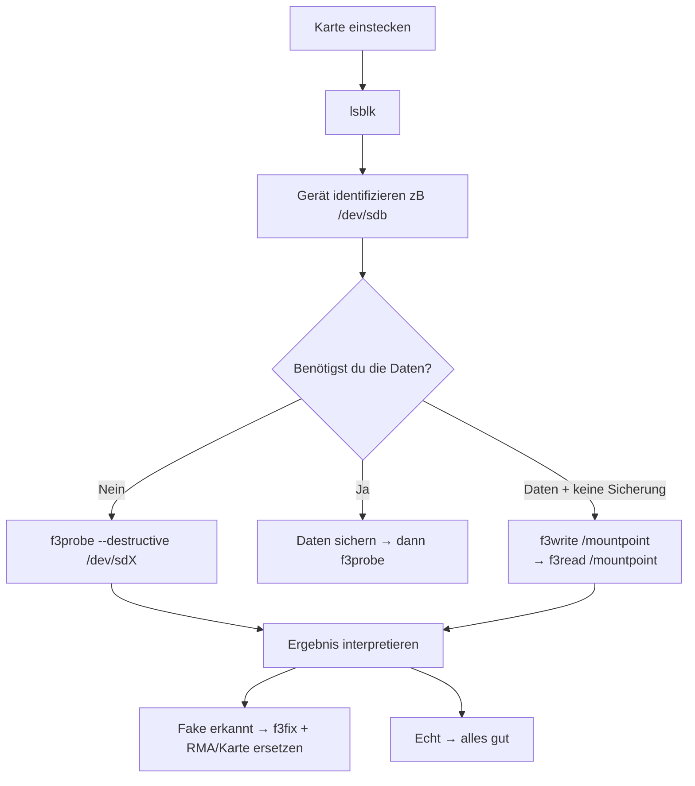

# Fake Storage Validation (SD/USB/Flash)

Erkennen von Fake-SD-Karten und USB-Sticks, die falsche Kapazitäten melden.

## Tool-Suite: f3 (Fight Flash Fraud)

```bash
sudo apt install f3
```

| Befehl | Wirkung | Destruktiv? |
|--------|---------|-------------|
| `f3probe /dev/sdX` | Schreibt über die ganze Karte, misst echte Kapazität | ✅ Ja (alle Daten weg) |
| `f3write /pfad` | Schreibt Testdateien auf freien Platz | ❌ Nur freie Blöcke |
| `f3read /pfad` | Liest Testdateien zurück und prüft | ❌ Keine Änderung |
| `f3fix /dev/sdX` | Repariert die Partition auf echte Größe | ✅ Ja (danach formatieren) |

## Workflow



## f3probe Ausgabe interpretieren

### Echte Karte (z.B. 64 GB Samsung)
```
F3 probe 8.0
Device: /dev/sdb
Device type: SCSI
Capacity: 64016322560 bytes (64 GB)
```

### Fake-Karte (z.B. meldet 500 GB, echt 8 GB)
```
WARNING: Device is a FAKE!
Device capacity: 500 GB
Real capacity: 8 GB
```

**Weitere Fake-Indikatoren:**
- USB-Reader ist No-Name (MXT, Chipbank, etc.)
- `lsusb` zeigt `aaaa:8816` Vendor/Product ID (MXT typisch)
- Seriennummer ist generisch wie `150101v01`
- Partition ist exFAT (viele Fakes nutzen exFAT)
- Karte läuft extrem langsam beim Lesen/Schreiben

## Critical: sudo + Terminal Problem

**f3probe REQUIRED sudo** (Raw-Device-Zugriff). Das Terminal-Tool von Hermes kann
sudo NICHT im Background-Modus (kein passwort-fähiges Terminal).

**Lösungen (absteigend empfohlen):**

1. **pty=true** — Befehl im interaktiven PTY starten, User kann Passwort tippen:
   ```python
   terminal(command="sudo f3probe --destructive /dev/sdb", pty=True, timeout=600)
   ```

2. **User-Task** — dem User sagen, er soll in einem richtigen Terminal ausführen:
   ```bash
   sudo f3probe --destructive /dev/sdb
   ```

3. **sudo -S NICHT erlaubt** — Passwort-Piping via Stdin wird von Hermes
   als Brute-Force-Angriff blockiert. Nicht versuchen!

4. **Workaround:** Wenn f3probe nicht geht, `f3write` + `f3read` auf dem
   gemounteten Volume verwenden — braucht KEIN sudo:
   ```bash
   f3write /media/bratan/sd-500
   f3read /media/bratan/sd-500
   ```
   ⚠️ Testet NUR freie Blöcke — bei fast voller Karte weniger aussagekräftig.

## UDEV-Info auslesen (nicht destruktiv)

```bash
# Gerät identifizieren
lsblk -o NAME,SIZE,TYPE,MODEL,SERIAL,TRAN

# USB-Reader erkennen
lsusb | grep -iE 'card|reader|mmc|sd|storage|flash'

# SCSI-Info
cat /sys/block/sdX/device/model
cat /sys/block/sdX/size   # Sektoren * 512 = gemeldete Bytes

# Partitionstyp
sudo blkid /dev/sdX1
```

## Andere Tools

| Tool | Zweck | Sudo? |
|------|-------|-------|
| `badblocks -wvs` | Jeden Block mit Muster beschreiben/testen | ✅ |
| `sdparm --long` | SCSI-Parameter des Geräts | ✅ |
| `hdparm -I` | ATA/SCSI-Identität | ✅ |
| `dd if=/dev/sdX of=/dev/null bs=1M` | Lesegeschwindigkeit (langsam = verdächtig) | ✅ |

## Bekannte Fake-Marken/Muster

- Karten mit unrealistischen Kapazitäten (>1TB als microSD, >512GB bei No-Name)
- Serial: `150101v01`, `AA000001` oder ähnlich generisch
- USB-Reader Chip: MXT `aaaa:8816`, Silicon Motion `090c:1000`
- Labeling: "sd-500", "usb-1tb", "high-speed-micro" — keine Markennamen
- Preis: Unter 10€ für 500GB = zu 99% Fake