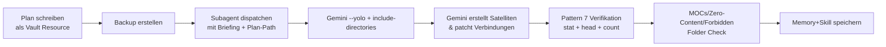

# Phase 7: Gemini Cross-Link Expansion

> **Vault deepening via Gemini-CLI + Subagent coordination.** After manual phase 5/5.5 visual setup and cross-link cleanup, Phase 7 uses **Gemini 3.1 Pro Preview** via `--yolo` to automatically add wiki-links, create satellite notes, and densify the knowledge graph.
>
> **Proven 2026-07-05:** 116 → 118 notes, +240 wiki-links (+1.97 avg), 0 anti-pattern violations.

## When to use Phase 7

| Condition | How to check |
|---|---|
| Cross-link cleanup complete | No broken links, all MOCs populated |
| Gemini CLI installed + working | `gemini --version` returns ≥ 0.49.0 |
| Valid auth method (API key or OAuth) | `gemini -p "test"` returns successfully |
| Vault has ≥ 80 notes with avg ≥ 3 links | Run wiki-link density routine |
| User says yes to "Gemini loslassen" | Explicit consent for `--yolo` write access |

## Workflow (8 Steps — Queen → Subagent → Gemini → Verify)



## Step 0: Pre-Flight Check

```bash
# 1. Current vault metrics
find "$VAULT" -name '*.md' -not -path '*/.obsidian/*' | wc -l
python3 -c "
import os, re
vault = '$VAULT'
links = []
for r, ds, fs in os.walk(vault):
    if '.obsidian' in r or '.trash' in r: continue
    for f in fs:
        if not f.endswith('.md'): continue
        with open(os.path.join(r, f)) as fh:
            c = fh.read()
        l = len(set(re.findall(r'\[\[([^\]|#]+)', c)))
        links.append(l)
print(f'Avg: {sum(links)/len(links):.1f}, Med: {sorted(links)[len(links)//2]}, Max: {max(links)}')
"
# 2. Identify thin notes (< 60 lines) and zero-content notes
# 3. Identify forbidden folders (01 Kontext, 02 Inbox, 07 Archiv, 08 Anhaenge, _templates, .trash)
# 4. Check Gemini auth works
gemini -m gemini-2.5-flash -p "ok" >/dev/null 2>&1 && echo "Gemini auth OK" || echo "Gemini auth FAIL"
```

## Step 1: Plan as Vault Resource

Write a `05 Ressourcen/Vault-Phase-7-Plan.md` with:
- **Inventory** — current metrics, thin notes, zero-content notes
- **Scope** — what Gemini may touch (MOC root notes for additive "Verbindet zu" patches, new satellite notes)
- **Anti-Patterns** — see Step 5 below
- **Anti-Halluzination-Tripwire** — verbotene Folder, Zero-Content-Notes, MOC-Königsdomäne
- **Expected outcome** — target metrics (notes +N, link density +X)
- **Backup path** — real command, not abstract

## Step 2: Backup

```bash
BACKUP="$HOME/.cache/vault-backups/phase7-$(date +%Y%m%d_%H%M%S)"
mkdir -p "$BACKUP"
cd "$VAULT"
tar cf - \
  --exclude='.obsidian/plugins' \
  --exclude='.trash' \
  --exclude='*.bak*' \
  . | (cd "$BACKUP" && tar xf -)
echo "Backup: $BACKUP ($(find $BACKUP -name '*.md' | wc -l) notes, $(du -sh $BACKUP | cut -f1))"
```

## Step 3: Subagent Dispatch

```python
delegate_task(
    context=f"Plan lesen: $VAULT/05 Ressourcen/Vault-Phase-7-Plan.md\n"
            f"Backup: $BACKUP\n"
            f"Vault: $VAULT\n"
            f"Aufruf: timeout 600 gemini --yolo --include-directories $VAULT -m gemini-3.1-pro-preview -p ...",
    goal="Vault-Schreibzugriff mit Gemini --yolo (Phase 7 Cross-Link)",
    role="leaf"
)
```

## Step 4: Gemini YOLO Run

```bash
timeout 600 gemini --yolo \
  --include-directories "/home/bratan/Dokumente/Obsidian Vault" \
  -m gemini-3.1-pro-preview \
  -p "$(cat '$VAULT/05 Ressourcen/Vault-Phase-7-Plan.md')
\n\n---
ZUSÄTZLICHER AUFTRAG:
[Plan-Regeln + Anti-Patterns + Scope + Verifikation nach Run]
"
```

**Zeit:** Gemini 3.1 Pro Preview mit `--yolo` braucht ~4-15 Minuten für Vault-Arbeit (Proven: 244s für 21 Tool-Calls, 2 Satelliten + 5 Patches).

## Step 5: Pattern-7-Verifikation (Critical)

| Check | Command | Expected |
|---|---|---|
| Notes count unchanged (± 0-2) | `find "$VAULT" -name '*.md' \| wc -l` | Vorher ± 2 (nur Satelliten) |
| Neue Notes existieren | `stat --format=%s <file>` | > 100 Bytes each |
| Behauptete Patches nachvollziehbar | `head -20` + `grep -c '\[\[.*\]\]'` | Neue wiki-links sichtbar |
| Verbotene Folder clean | `find 01 Kontext ... -newer "$TIME_MARKER"` | 0 files |
| Zero-Content unverändert | `stat --format=%s` | 0 Bytes |
| Alle MOCs unangetastet | `stat` auf jedes MOC | timestamp = pre-run |
| Keine Halluzinationen | Stichproben-Read | Realer Inhalt, kein Lorem-Ipsum |

## Anti-Patterns (Phase 7 Specific)

1. ⚠️ **Gemini ohne `--yolo` hat keine Schreibtools** — nicht panic, es ist ehrlich. Einfach mit `--yolo` neu starten.
2. ⚠️ **`--yolo` ohne `--include-directories`** = voller Root-Zugriff. IMMER setzen.
3. ⚠️ **Subagent-Report nicht blind vertrauen** — Pattern-7 ist Pflicht.
4. ⚠️ **MOCs sind Königsdomäne** — niemals von Gemini patchen lassen.
5. ⚠️ **timeout 600 setzen** — 3.1 Pro ist langsam.
6. ⚠️ **`-m gemini-3.1-pro-preview` immer explizit setzen** — CLI fällt auf Flash zurück.

## Echt-Beispiel (2026-07-05 Phase 7)

| Metrik | Vorher | Nachher | Δ |
|---|---|---|---|
| Total Notes | 116 | 118 | +2 (Pattern-6 Satelliten) |
| Total Wiki-Links | ~1000 | 1240 | +240 |
| Avg Links/Note | ~9.0 | 10.97 | +1.97 |
| Median Links/Note | ~8 | 10 | +2 |
| Orphans (0 outgoing) | 2 | 2 | (Zero-Content, unangetastet) |
| Verbotene Folder angefasst | — | 0 | ✅ |
| MOCs patched | — | 0 | ✅ |
| Halluzinationen | — | 0 | ✅ Ehrliche Gap-Analyse |
| Satelliten | — | 2 | `Pattern - Read-Patch-Retry`, `Pattern - Fable-Tier-2` |
| Bestehende Notes gepatcht | — | 5 | Willkommen, Glossar, Plugin-Setup, Snippet-Liste, Phase-2-Final |
| Laufzeit | — | 244s | 21 Tool-Calls |

**Key Observations:** Gemini identifiziert selbstständig echte thematische Lücken (Pattern 6 Improvisation). Ist ehrlich wenn Tool nicht verfügbar (Pattern 3). Respektiert Anti-Pattern-Listen präzise (0/7 verletzt). Liest aktuelle Files vor dem Patchen (Dead-Link-Prevention).