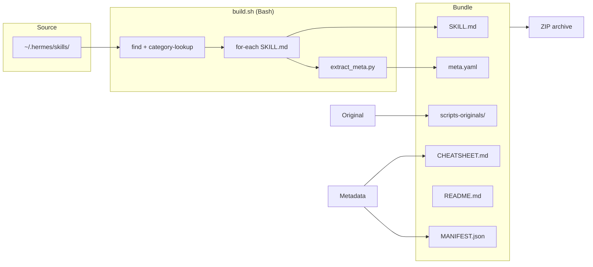

# Hermes → MiniMax.io CLI Batch Conversion Pattern

**Session:** 2026-07-07 · **Skills converted:** 84
**Environment:** `~/.hermes/skills/<category>/<name>/SKILL.md` → flat-id `hub-skills/<name>/SKILL.md`

## Architecture



## Pattern: Bash Orchestration + Python Parser

**Why bash?** File discovery (find, recursive walking), collection I/O, and ZIP packaging are simpler in bash.
**Why separate Python?** YAML frontmatter block-scalar parsing with heredoc boundary escapes is fragile inline (bash heredoc `<< 'EOF'` with Python multi-line strings causes silent truncation). Keep the parser as a standalone `.py` file and call it from bash.

### Template: `build.sh`

```bash
#!/usr/bin/env bash
set -euo pipefail

# === CONFIGURATION ===
# Add skill names here to include them; or invert with EXCLUDE_NAMES
INCLUDE_NAMES=(
    claude-coder systematic-debugging critic-gate github-workflow
    multi-agent-master-workflow test-driven-development ui-factory
    # ... add full list
)

# Agressive EXCLUDE — filter by platform cap
EXCLUDE_CATEGORIES=("gaming" "computer-use" "desktop")
EXCLUDE_WORDS=("linux" "nvidia" "docker" "obsidian" "hermes-admin"
               "hermes-gateway" "apple" "mcp-server" "greyhack")
EXCLUDE_SKILLS=("node-inspect-debugger" "python-debugpy")

SRC="${HERMES_SKILLS:-$HOME/.hermes/skills}"
DEST="/tmp/minimax-bundle/hub-skills"
SCRIPT_DIR="$(cd "$(dirname "$0")" && pwd)"

mkdir -p "$DEST"
count=0

# Discover all skills by category
for cat in $(ls "$SRC"); do
    [ -d "$SRC/$cat" ] || continue
    # Skip excluded categories
    for exc in "${EXCLUDE_CATEGORIES[@]}"; do
        [[ "$cat" == "$exc" ]] && continue 2
    done
    for skill_dir in "$SRC/$cat"/*/; do
        name="$(basename "$skill_dir")"
        # Skill-name based exclude
        for exc in "${EXCLUDE_SKILLS[@]}"; do
            [[ "$name" == "$exc" ]] && continue 2
        done
        # Word-based exclude
        for word in "${EXCLUDE_WORDS[@]}"; do
            [[ "$name" == *"$word"* ]] && continue 2
        done
        src_skill="$skill_dir/SKILL.md"
        [ -f "$src_skill" ] || continue

        dest_skill="$DEST/$name"
        mkdir -p "$dest_skill"
        cp "$src_skill" "$dest_skill/SKILL.md"

        # Provenance
        mkdir -p "$dest_skill/scripts-originals"
        cp "$src_skill" "$dest_skill/scripts-originals/SKILL.md.hermes-original"
        echo "Hermes-source: $cat/$name" > "$dest_skill/scripts-originals/SOURCE.txt"

        # References, templates, scripts assets
        for asset_dir in references templates scripts; do
            [ -d "$skill_dir/$asset_dir" ] && cp -r "$skill_dir/$asset_dir" "$dest_skill/"
        done

        # meta.yaml via Python extractor
        python3 "$SCRIPT_DIR/extract_meta.py" "$src_skill" "$name" "$cat" "$skill_dir" "$dest_skill"

        count=$((count + 1))
    done
done

echo "✅ $count skills converted to $DEST"
```

### Template: `extract_meta.py`

```python
#!/usr/bin/env python3
"""Extract YAML frontmatter from a Hermes SKILL.md → MiniMax meta.yaml.

Usage: extract_meta.py <src_skill.md> <name> <category> <src_dir> <dest_dir>

Handles:
- Block-scalar (| and >) multi-line description
- Single-line description
- Trigger-words / triggers list
- Provenance preservation
"""
import re, pathlib, sys

src, name, src_cat, src_dir, dest_dir = sys.argv[1:6]
fm_text = pathlib.Path(src).read_text()

# Extract frontmatter block
m = re.match(r"^---\n(.*?)\n---\n", fm_text, re.DOTALL)
if not m:
    fm_text_short = ""
else:
    fm_text_short = m.group(1)

# Description — block-scalar aware
desc = ""
m1 = re.search(r"^description:\s*['\"]?(.*?)['\"]?\s*$", fm_text_short, re.MULTILINE)
if m1:
    desc = m1.group(1).strip().strip("'\"")
else:
    m2 = re.search(r"^description:\s*[|>]\s*\n((?:  .*\n?)+)", fm_text_short, re.MULTILINE)
    if m2:
        desc = "\n".join(line[2:] for line in m2.group(1).splitlines()).strip()

# Triggers / trigger-words
triggers = []
m3 = re.search(r"^triggers:\s*\[(.*?)\]", fm_text_short, re.MULTILINE)
if m3:
    triggers = [t.strip().strip("'\"") for t in m3.group(1).split(",") if t.strip()]
m4 = re.search(r"^trigger-words:\s*\[(.*?)\]", fm_text_short, re.MULTILINE)
if m4:
    triggers = [t.strip().strip("'\"") for t in m4.group(1).split(",") if t.strip()]

yaml = f"""name: {name}
display-name: {name.replace('-', ' ').title()}
version: "1.0.0"
author: "Basti (Hermes-Skill conversion)"
license: MIT
source: "Hermes Skills Library ~/.hermes/skills/{src_cat}/{name}/"
description: |
  {desc.replace(chr(10), chr(10) + '  ')[:600]}
trigger-words:
"""
for t in triggers[:8]:
    yaml += f"  - {t}\n"

yaml += f"""provenance:
  original-category: {src_cat}
  original-skill-path: {src_dir}/SKILL.md
  converted-by: yuno-bundle-builder
  date: 2026-07-07
  hermes-skill-format: 'YAML frontmatter + Markdown body'
  minimax-skill-format: 'Same (Hub reads SKILL.md directly)'
"""
pathlib.Path(f"{dest_dir}/meta.yaml").write_text(yaml)
```

## Pitfall: Bash Heredoc + Python Multi-line Strings

Inline Python via `python3 - << 'PYEOF'` AND multi-line f-strings with nested brace interpolation causes **silent truncation**. The shell's heredoc marker is consumed before Python sees the first line, but the Python f-string braces `{...}` can clash with shell variable substitution depending on quoting.

**Fix:** Always write the Python helper as a standalone `.py` file and call it from bash with positional args. Never inline large Python blocks.

## Companion Artifacts

Every batch conversion should produce these alongside the skills:

| Artifact | Content |
|---|---|
| `CHEATSHEET.md` | Slash-command mapping: skill name → trigger phrases → use-case (one-line per skill, categorized). User reads this FIRST. |
| `README.md` | Upload instructions per target platform (GitHub repo, file upload, chat paste). List excluded skills and why. |
| `MANIFEST.json` | Machine-readable: skill count, total size, per-skill `{name, size_kb, has_assets, category}`. Use for integrity checks. |
| `build.sh` | The build script itself — reproducible, idempotent. |
| `extract_meta.py` | The parser standalone. |

### CHEATSHEET.md skeleton

```markdown
# Yuno MiniMax Skills — Cheatsheet

## Coding (12 Skills)
| /skill | Use |
|--------|-----|
| `/claude-coder` | Schreib mir X in Sprache Y |
| `/plan` | Mach einen Implementierungsplan |

## Debugging (8 Skills)
| /skill | Use |
|--------|-----|
| `/systematic-debugging` | Warum crasht X? |
```

## Exclusion Rules per Target Platform

This reduces context waste — don't package skills the target can't use.

| Platform | Exclude |
|----------|---------|
| **MiniMax.io** (M3 Agent Team) | computer-use, greyhack-*, linux-*, nvidia-*, docker-*, hermes-admin/hermes-gateway, obsidian-*, apple/macOS-*, mcp-server-authoring (needs local MCP) |
| **Claude Code CLI** | All computer-use (requires GUI), systemd/linux-service skills |
| **Codex CLI** | Same as Claude Code + no python-debugpy (uses built-in debugger) |
| **OpenCode** | Same as Codex + no greyhack, no gaming |
| **Gemini CLI** | No greyhack, no nvidia-tools, no docker-compose |
