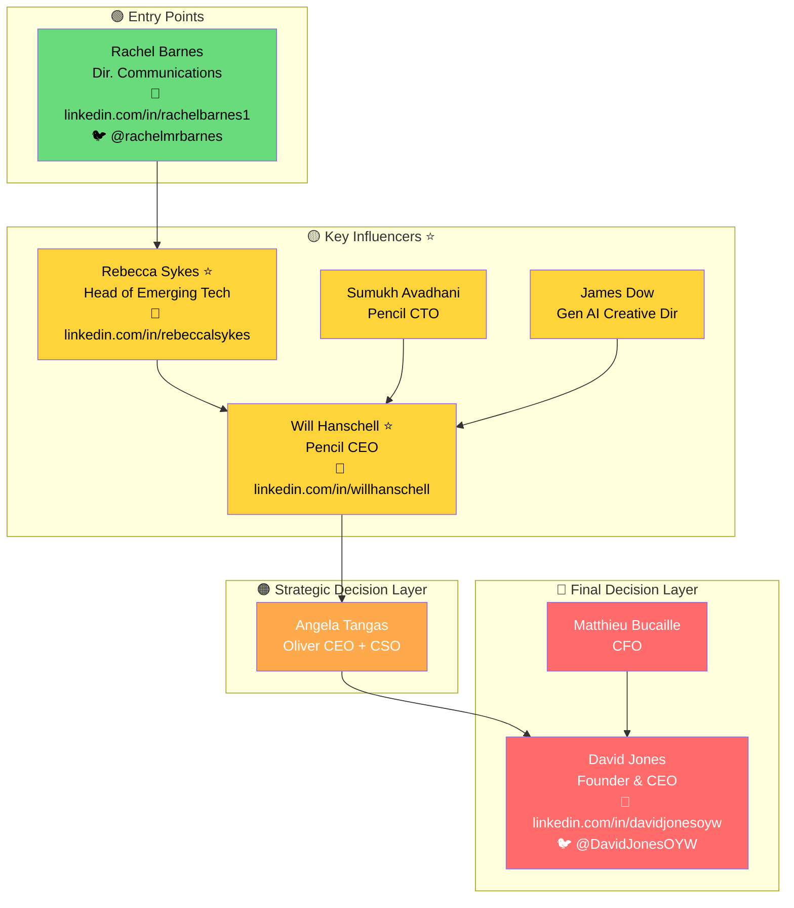

# Power Map Intelligent Sales Assistant

## Overview

This skill helps B2B salespeople go from a vague product pitch ("I want to sell XX") to an actionable sales plan with a visual Power Map of decision makers, contact information, and a recommended path to close. It handles two scenarios: (A) only a product is known and target companies must be discovered, or (B) both product and target company are specified and the Power Map is built directly.

## Trigger Conditions

Activate when user input contains patterns like:
- "I want to sell XX..."
- "I want to sell XX to YY company..."
- "Help me find customers for XX..."
- "Help me draw a power map..."
- "Analyze the decision makers at XX company..."

## Workflow

### Step 1: Intent Parsing

Extract from user input and determine which scenario applies:

**Scenario A — Only Product, No Target Company**
- User only mentions product/service, no specific company
- Uses expressions like "sell", "find customers", "find buyers"
- Examples: "I want to sell MiniMax Hailuo video model", "I have an AI customer service product, who should I sell it to?"

**Scenario B — Clear Product and Target Company**
- User mentions both product and target company
- Uses expressions like "sell to XX company", "find people at XX company"
- Examples: "I want to sell MiniMax Hailuo to Brandtech Group", "Help me analyze Nike's AI procurement decision makers"

**Extract the following dimensions:**

```yaml
Extraction Dimensions:
  product_name: "Product Name"
  product_type: "Product Type (SaaS/Hardware/Service, etc.)"
  product_category: "Product Category (AI/Marketing/Finance, etc.)"
  key_features: ["Core Feature 1", "Core Feature 2"]
  target_use_case: "Target Use Case"
```

If a target company is mentioned, also extract:

```yaml
  company_name: "Company Name"
  company_aliases: ["Alias 1", "Alias 2"]
  industry_hint: "Industry Hint (inferred from context)"
```

Based on product characteristics, infer the related domain and likely decision-maker types:

```yaml
focus_area: "AI Video Generation Integration"
decision_makers_hint:
  - "CTO / VP Engineering"
  - "Head of AI"
  - "VP Product"
  - "Creative Director"
```

**Output structured intent analysis:**

```yaml
intent_analysis:
  scenario: "A"  # or "B"
  confidence: 0.95
  product:
    name: "MiniMax Hailuo"
    type: "AI Model/API Service"
    category: "AI Video Generation"
    features:
      - "Text-to-Video"
      - "High-Quality AI Generation"
      - "API Integration"
    use_cases:
      - "Advertising Video Production"
      - "Marketing Content Creation"
      - "Social Media Content"
  target_company:
    name: "Brandtech Group"  # Scenario A: null
    aliases: ["Brandtech"]
    industry: "AdTech/MarTech"
  focus_area: "AI Video Generation Model Integration"
  target_personas:
    - title: "CTO"
      relevance: "Technical Procurement Decision"
    - title: "Head of AI"
      relevance: "AI Strategy Lead"
    - title: "VP Product"
      relevance: "Product Integration Decision"
    - title: "Creative Director"
      relevance: "Creative Tools Procurement"
  next_step: "target-finder"  # Scenario A
  # next_step: "org-miner"    # Scenario B
```

**Scenario A display:**
```
📋 Intent Analysis Complete

Product: MiniMax Hailuo AI Video Generation Model
Type: AI Model/API Service
Application Scenarios: Advertising Video Production, Marketing Content Creation

⚠️ No Clear Target Company Detected

Searching for potential target customers for you...
```

**Scenario B display:**
```
📋 Intent Analysis Complete

Product: MiniMax Hailuo AI Video Generation Model
Target Company: Brandtech Group
Related Domain: AI Video Generation Integration

Decision Maker Types to Find:
  ✓ CTO / VP Engineering
  ✓ Head of AI
  ✓ VP Product
  ✓ Creative Director

Searching Brandtech Group's organization structure...
```

**Edge Case Handling:**

| Situation | Handling Method |
|-----------|-----------------|
| Unclear Product Description | Ask user to supplement product information |
| Company Name Misspelling | Attempt to correct and confirm |
| Multiple Target Companies | List and let user choose priority |
| Non-B2B Product | Remind that this tool is mainly for B2B sales scenarios |

If Scenario A → proceed to Step 2. If Scenario B → skip to Step 3.

---

### Step 2: Target Company Discovery (Scenario A Only)

Only executed when user has not specified a target company.

#### 2a: Analyze Target Customer Profile

Infer target customers based on product type:

```yaml
target_customer_profile:
  industries:
    - "Advertising/MarTech Companies"
    - "MCN/Content Creation Platforms"
    - "Brands"
    - "Film/Game Companies"
    - "E-commerce Platforms"
  company_characteristics:
    - "Already invested in AI/technology"
    - "High content production demand"
    - "Seeking efficiency improvements"
    - "Has innovation culture"
  decision_maker_types:
    - "CTO / VP Engineering"
    - "Head of AI"
    - "Creative Director"
    - "VP Marketing"
```

#### 2b: Search for Potential Companies Online

Execute multiple rounds of web search:

```
Search 1: Industry Leaders
  "[Product Category] customers"
  "[Product Category] enterprise clients"
  "companies using [Product Category]"

Search 2: Competitor Customers
  "[Competitor Name] customers case studies"
  "[Competitor Name] partners"

Search 3: Industry News
  "[Industry] AI adoption 2024 2025"
  "brands using generative AI video"

Search 4: Search by Industry
  "top advertising agencies AI"
  "media companies AI transformation"
  "brands digital content strategy"
```

**Search Strategies for Different Product Types:**

| Product Type | Search Keywords | Target Industries |
|--------------|-----------------|-------------------|
| AI Video Generation | video generation, AI content creation | Advertising, Media, Brands |
| AI Customer Service | customer service automation, chatbot | E-commerce, Finance, SaaS |
| BI Tools | business intelligence, data analytics | Enterprise, Finance, Retail |
| Marketing Automation | marketing automation, lead generation | B2B, SaaS, E-commerce |

#### 2c: Filter and Evaluate

Evaluate discovered companies:

| Dimension | Weight | Evaluation Criteria |
|-----------|--------|---------------------|
| Demand Match | 30% | Is there a clear product use case |
| Company Size | 20% | Has procurement capability and budget |
| AI Maturity | 20% | Already has AI investment, easy to accept new technology |
| Reachability | 15% | Are decision makers easy to find |
| Competition | 15% | Already using competitor products |

#### 2d: Present Recommendations to User

Output categorized recommendations:

```markdown
📋 Discovered the Following Potential Target Companies

Based on your product【{Product Name}】, recommended targets:

---

### 🏢 Advertising/MarTech Companies (Recommended Priority)
High video content production demand, active AI investment

| # | Company | Priority | Recommendation Reason |
|---|---------|----------|----------------------|
| 1 | Brandtech Group | 🔥 P0 | Global leading MarTech, has AI platform Pencil, aggressive AI strategy |
| 2 | WPP | ⭐ P1 | World's largest advertising group, actively exploring AI transformation |
| 3 | Publicis Groupe | ⭐ P1 | Large advertising group, in digital transformation |

---

### 🏢 Content Platforms
Large-scale content production demand

| # | Company | Priority | Recommendation Reason |
|---|---------|----------|----------------------|
| 4 | Netflix | ⭐ P1 | Large content production scale, high technology investment |
| 5 | TikTok/ByteDance | ⭐ P1 | Short video platform, creation tool needs |

---

### 🏢 Brands
High marketing video content demand

| # | Company | Priority | Recommendation Reason |
|---|---------|----------|----------------------|
| 6 | Nike | 📌 P2 | Leading brand in digital marketing |
| 7 | Coca-Cola | 📌 P2 | Large global marketing investment |

---

🎯 **Recommended First Choice**: {Top Company} ({Reason})

Please select the company to analyze in depth:
- Enter number (e.g.: 1)
- Enter company name (e.g.: Brandtech Group)
- Enter "all" to analyze Top 3
```

Wait for user selection, then proceed to Step 3.

**Tools used:** `WebSearch` — Batch search for potential customers

---

### Step 3: Organization Mining

After determining the target company, deep search for key people.

#### 3a: Company Basic Information Search

```
Search Targets:
  - Company website
  - LinkedIn company page
  - Wikipedia/Crunchbase

Extract Information:
  - Company description
  - Headquarters location
  - Employee count
  - Subsidiaries/Product lines
```

#### 3b: Leadership Team Search

```
Search Syntax:
  - "[Company Name] leadership team"
  - "[Company Name] executive team"
  - "[Company Name] management team 2024 2025"
  - "site:[Company Website] about leadership"

Search Platforms:
  - Company website About/Team page
  - LinkedIn
  - News reports
```

#### 3c: Related Domain Leader Search

Based on the product's related domain, perform targeted searches:

```
AI Related:
  - "[Company Name] CTO"
  - "[Company Name] Chief Technology Officer"
  - "[Company Name] Head of AI"
  - "[Company Name] VP Engineering"
  - "site:linkedin.com [Company Name] AI"

Product Related:
  - "[Company Name] VP Product"
  - "[Company Name] Chief Product Officer"

Creative/Content Related:
  - "[Company Name] Creative Director"
  - "[Company Name] Head of Creative"
  - "[Company Name] Chief Creative Officer"
```

#### 3d: Subsidiary/Product Line Leaders

If company has related subsidiaries or product lines:

```
Example (Brandtech → Pencil):
  - "Pencil AI CEO"
  - "Pencil leadership team"
  - "[Subsidiary Name] founder"
```

#### 3e: External Communication Personnel (Entry Points)

```
Search Syntax:
  - "[Company Name] Director of Communications"
  - "[Company Name] PR contact"
  - "[Company Name] Head of Marketing"
```

#### 3f: News/Interview Verification

Verify person's role and importance through news:

```
Search Syntax:
  - "[Person Name] [Company Name] interview"
  - "[Person Name] [Company Name] announcement"
  - "[Company Name] AI partnership 2024"
```

#### Quality Standards

- [ ] Found CEO/Founder
- [ ] Found leaders directly related to the domain
- [ ] Each person has LinkedIn link
- [ ] Verified person is currently employed
- [ ] Recorded information source
- [ ] Found at least one entry point

**Tools used:** `WebSearch` — Multiple rounds of search

---

### Step 4: Decision Chain Analysis

Analyze the people found and classify them into the decision hierarchy.

#### 4a: People Layer Classification

| Layer | Identifier | Typical Positions | Role |
|-------|------------|-------------------|------|
| 🔴 Final Decision Layer | Highest Difficulty | CEO, Founder, President | Final Approval, Veto Power |
| 🟠 Strategic Decision Layer | High Difficulty | CSO, CFO, COO | Strategic Approval, Budget Control |
| 🟡 Key Influencers | ⭐Recommended Breakthrough | CTO, VP Product, Head of AI | Technical Evaluation, Procurement Driving |
| 🟢 Entry Points | Easiest to Reach | PR, Communications | Establish Initial Contact |

#### 4b: Classification Rules

```python
def classify_person(person):
    title = person.title.lower()

    # 🔴 Final Decision Layer
    if any(keyword in title for keyword in ['ceo', 'founder', 'president', 'owner']):
        return 'final_decision'

    # 🟠 Strategic Decision Layer
    if any(keyword in title for keyword in ['cfo', 'cso', 'coo', 'chief strategy', 'chief financial']):
        return 'strategic'

    # 🟡 Key Influencers
    if any(keyword in title for keyword in ['cto', 'vp', 'head of', 'director of', 'chief technology', 'chief product']):
        if is_relevant_to_focus_area(person, focus_area):
            return 'key_influencer'

    # 🟢 Entry Points
    if any(keyword in title for keyword in ['communications', 'pr', 'public relations', 'marketing manager']):
        return 'entry_point'

    return 'other'
```

#### 4c: Reporting Relationship Inference

Infer reporting relationships based on:

1. **Position Level**: VP → C-Level
2. **Department Affiliation**: Head of AI → CTO or CPO
3. **Subsidiary Relationship**: Subsidiary CEO → Parent Company CEO
4. **Public Information**: News, LinkedIn descriptions

#### 4d: Identify Key Breakthrough Points

Evaluate each person's breakthrough value:

| Dimension | Weight | Description |
|-----------|--------|-------------|
| Domain Relevance | 40% | Direct relevance to product domain |
| Decision Authority | 30% | Has technical procurement or partnership decision authority |
| Reachability | 20% | Easy to establish contact |
| Upward Influence | 10% | Can influence final decision makers |

**Recommendation Marking Rules**:
- Highly relevant to domain + Has decision authority → ⭐ Recommended Breakthrough
- High reachability + Can make referrals → Use as entry point

#### 4e: Design Flanking Strategy

Design primary and alternative contact paths:

```yaml
strategy:
  primary_path:
    name: "Standard Path"
    steps:
      - target: "Entry Point Person"
        layer: "entry_point"
        action: "Establish initial contact through PR channel"
        goal: "Get internal meeting/event opportunity"

      - target: "Technology Gatekeeper"
        layer: "key_influencer"
        action: "Technical demo, get technical endorsement"
        goal: "Pass technology gatekeeper evaluation"

      - target: "AI Platform Lead"
        layer: "key_influencer"
        action: "Business partnership discussion"
        goal: "Drive platform integration"

      - target: "CEO/Founder"
        layer: "final_decision"
        action: "Strategic partnership confirmation"
        goal: "Final approval"

  alternative_paths:
    - name: "Partner Referral"
      description: "Referral through existing partners"
      suitable_when: "Have mutual partners"

    - name: "Industry Event Contact"
      description: "Contact key people at industry events"
      suitable_when: "Have opportunity to attend similar events"

    - name: "Investor/Board Referral"
      description: "Referral through mutual investors"
      suitable_when: "Have mutual investment background"
```

---

### Step 5: Contact Information Retrieval

Complete contact information for each key person found.

#### 5a: LinkedIn URL Confirmation

```
Search Syntax:
  - "[Name] [Company Name] LinkedIn"
  - "site:linkedin.com/in [Name] [Company Name]"
  - "[Name] [Title] LinkedIn"

Verification Points:
  - Company name matches
  - Title matches
  - Account active (recent activity)
```

#### 5b: Twitter/X Account Search

```
Search Syntax:
  - "[Name] [Company Name] Twitter"
  - "[Name] @"
  - Find Twitter link from LinkedIn page

Verification Points:
  - Confirm it's the correct person
  - Account active
```

#### 5c: Email Search

**Method Priority**:

1. **Company Website Search** — About/Team page, Press/Contact page
2. **Email Format Inference**:
   ```
   Common Formats:
   - firstname@company.com
   - firstname.lastname@company.com
   - f.lastname@company.com
   ```
3. **Search Verification** — "[Name] [Company] email"
4. **Tool Assistance** — Hunter.io, Apollo.io

#### 5d: Other Contact Methods

Search based on person type:
- **Technical Staff**: GitHub, Medium, Personal Blog
- **Creative Staff**: Behance, Dribbble
- **Executives**: Public Speeches, Podcast Appearances

#### 5e: Best Contact Method Recommendation

Recommend best contact method for each person:

```yaml
contact_recommendation:
  - name: "Will Hanschell"
    best_channel: "LinkedIn InMail"
    reason: "CEO level, LinkedIn is most professional"
    alternative: "Industry event contact"

  - name: "Rachel Barnes"
    best_channel: "LinkedIn + Twitter"
    reason: "PR role, active on social media"
    alternative: "Company PR email"
```

**Tools used:** `WebSearch` — Search for contact information

---

### Step 6: Power Map Generation

Generate all visual outputs and the complete report.

#### 6a: Generate Mermaid Diagram

Create a decision chain diagram using Mermaid syntax:



**Layer Color Codes:**
- 🔴 Final Decision: `#ff6b6b` (red)
- 🟠 Strategic Decision: `#ffa94d` (orange)
- 🟡 Key Influencers: `#ffd43b` (yellow)
- 🟢 Entry Points: `#69db7c` (green)

#### 6b: Generate Complete Report

Assemble the final report in this structure:

```markdown
# {Company Name} Power Map Analysis Report

> Generated: {Date}
> Product: {Product Name}
> Related Domain: {Related Domain}

---

## 🗺️ Decision Maker Relationship Map

[Insert Mermaid Diagram]

---

## 📋 Key People Analysis

### 🔴 Final Decision Layer (Highest Difficulty)

| Person | Title | Role | LinkedIn | Twitter |
|--------|-------|------|----------|---------|
| ... | ... | ... | ... | ... |

### 🟠 Strategic Decision Layer (High Difficulty)

| Person | Title | Role | LinkedIn |
|--------|-------|------|----------|
| ... | ... | ... | ... |

### 🟡 Key Influencers (⭐Recommended Focus Breakthrough)

| Person | Title | Role | LinkedIn | Why Recommended |
|--------|-------|------|----------|-----------------|
| ... | ... | ... | ... | ... |

### 🟢 Entry Points (Easiest to Reach)

| Person | Title | Role | LinkedIn | Twitter |
|--------|-------|------|----------|---------|
| ... | ... | ... | ... | ... |

---

## 🎯 Flanking Strategy

### Recommended Path

{Entry Point} → {Tech Gatekeeper} → {Key Influencer} → {Final Decision Maker}

### Execution Points

1. **Step 1: Contact {Entry Point}**
   - Channel: LinkedIn Connection Request / Twitter DM
   - Goal: Establish initial contact
   - Talking Points: Lead with industry topics, don't directly pitch

2. **Step 2: Win {Tech Gatekeeper} Technical Endorsement**
   - Channel: LinkedIn InMail
   - Goal: Get technical evaluation opportunity
   - Prepare: Technical demo, compliance statement

3. **Step 3: Drive {Key Influencer} Business Partnership**
   - Channel: LinkedIn InMail / Formal Meeting
   - Goal: Explore platform integration
   - Prepare: ROI cases, competitor comparison

4. **Step 4: Get {Final Decision Maker} Approval**
   - Channel: Through internal referral / Strategic partnership proposal
   - Goal: Final decision
   - Prepare: Strategic value proposal

### Alternative Strategies

| Strategy | Description | Suitable When |
|----------|-------------|---------------|
| Partner Referral | Referral through existing partners | Have mutual partners |
| Industry Event Contact | Contact at industry events | Have opportunity to attend |
| Investor Referral | Referral through mutual investors | Have mutual investment background |

---

## ⚠️ Important Notes

[Key company-specific insights discovered during research]

---

## 📞 Contact Information Summary

| Layer | Name | Title | LinkedIn | Twitter | Email |
|-------|------|-------|----------|---------|-------|
| ... | ... | ... | ... | ... | ... |

---

## 🚀 Next Steps

1. **Today**: Send LinkedIn Connection Request to {Entry Point}
2. **This Week**: Prepare technical demo materials for {Tech Gatekeeper}
3. **Watch For**: Industry events, look for contact opportunities

---

*Report Generated: {Timestamp}*
*Tool: Power Map Intelligent Sales Assistant*
```

---

## Output Format by Scenario

### Scenario A Output (Find Customers + Power Map)

```markdown
# Sales Plan: {Product Name}

## 📊 Target Customer Analysis

Based on【{Product Name}】characteristics, recommended target customers:

| Priority | Company | Industry | Recommendation Reason |
|----------|---------|----------|----------------------|
| 🔥 P1 | ... | ... | ... |
| ⭐ P2 | ... | ... | ... |

---

## 🗺️ Power Map: {Selected Company}

[Mermaid Diagram]

### Key People
[People table by hierarchy, with contact info]

### 🎯 Flanking Strategy
[Recommended path and execution points]

---

## 📋 Next Steps

1. 🔥 Priority Contact: [Best Entry Person] - [LinkedIn Link]
2. Prepare Materials: Technical demo for [Key Influencer]
3. Watch Events: [Related Industry Events]
```

### Scenario B Output (Direct Power Map)

```markdown
# {Company Name} Power Map - {Related Domain}

## 🗺️ Decision Maker Relationship Map
[Mermaid Diagram]

---

## 📋 Key People Analysis
[Tables by hierarchy layer]

---

## 🎯 Flanking Strategy
[Recommended Path + Execution Points + Alternative Strategies]

---

## 📞 Contact Information Summary
[Complete Contact Info Table]

---

## 📁 Output Files
- Power Map Mermaid: [Embedded diagram]
```

---

## Key Principles

1. **Quick Response**: Start acting as soon as user asks, don't over-confirm
2. **Smart Inference**: Extract key information from vague inputs
3. **Results-Oriented**: Ultimately provide actionable contact plans
4. **Visualization First**: Power Map diagram is the core deliverable
5. **Verify Information**: Cross-reference people across multiple sources; mark unverified info clearly
6. **Privacy Awareness**: Only use publicly available information; do not fabricate contact details
