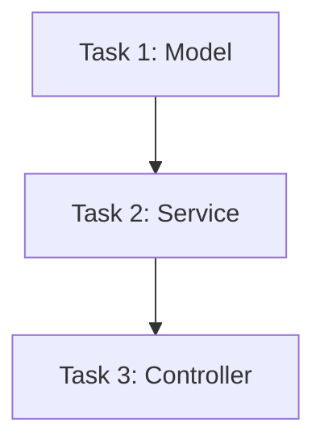

# [FEATURE NAME] Implementation Plan

> **For agentic workers:**
> REQUIRED SUB-SKILL: Use `superpower-10x:subagent-driven-execution`
> Plan Status: `Draft | In Progress | Complete`

**Goal:** [One sentence describing what this builds]

**Architecture:** [2-3 sentences about the approach]

**Tech Stack:** [Key technologies/libraries]

**Created:** YYYY-MM-DD

---

## Quick Reference

| Item | Value |
|------|-------|
| Feature | [Name] |
| Branch | `feature/[name]` |
| Spec | `docs/superpowers/specs/YYYY-MM-DD-[name]-design.md` |
| Tests | `tests/` |
| Coverage Target | 80% |

---

## Task Breakdown

### Task 1: [Component Name - Start with Data Model or Core Entity]

**Prerequisites:** None

**Files:**
- Create: `src/models/[name].model.ts`
- Create: `tests/unit/models/[name].model.test.ts`
- Create: `prisma/migrations/YYYYMMDDHHMMSS_create_[name>_table`

- [ ] **Step 1: Write the failing test**

  ```typescript
  // tests/unit/models/[name].model.test.ts
  import { describe, it, expect } from 'vitest';
  import { [Name]Model } from '@/models/[name].model';

  describe('[Name]Model', () => {
    describe('create', () => {
      it('should create a new [name] with valid data', async () => {
        const data = {
          name: 'Test [Name]',
          description: 'Test description'
        };

        const result = await [Name]Model.create(data);

        expect(result.id).toBeDefined();
        expect(result.name).toBe(data.name);
        expect(result.createdAt).toBeInstanceOf(Date);
      });

      it('should throw ValidationError for invalid data', async () => {
        const invalidData = { name: '' };

        await expect([Name]Model.create(invalidData))
          .rejects.toThrow('ValidationError');
      });
    });
  });
  ```

- [ ] **Step 2: Run test to verify it fails**

  ```bash
  npm test -- tests/unit/models/[name].model.test.ts --run
  # Expected: FAIL - [Name]Model is not defined
  ```

- [ ] **Step 3: Write minimal implementation**

  ```typescript
  // src/models/[name].model.ts
  import { z } from 'zod';

  const [Name]Schema = z.object({
    name: z.string().min(1).max(255),
    description: z.string().optional()
  });

  export type [Name]Input = z.infer<typeof [Name]Schema>;

  export class [Name]Model {
    static async create(data: [Name]Input) {
      // Validation
      const validated = [Name]Schema.parse(data);

      // Database operation
      const result = await prisma.[name].create({
        data: validated
      });

      return result;
    }
  }
  ```

- [ ] **Step 4: Run test to verify it passes**

  ```bash
  npm test -- tests/unit/models/[name].model.test.ts --run
  # Expected: PASS
  ```

- [ ] **Step 5: Commit**

  ```bash
  git add src/models/[name].model.ts tests/unit/models/[name].model.test.ts
  git commit -m "feat(models): add [Name]Model with create method

  - Add Zod schema for validation
  - Add create static method
  - Add unit tests for happy path and validation"
  ```

---

### Task 2: [Service Layer - Business Logic]

**Prerequisites:** Task 1

**Files:**
- Create: `src/services/[name].service.ts`
- Create: `tests/unit/services/[name].service.test.ts`
- Modify: `src/models/[name].model.ts`

- [ ] **Step 1: Write the failing test**

  ```typescript
  // tests/unit/services/[name].service.test.ts
  import { describe, it, expect, vi } from 'vitest';
  import { [Name]Service } from '@/services/[name].service';
  import { [Name]Model } from '@/models/[name].model';

  vi.mock('@/models/[name].model');

  describe('[Name]Service', () => {
    describe('createWithDefaultSettings', () => {
      it('should create [name] with default settings', async () => {
        const mockCreate = vi.fn().mockResolvedValue({
          id: '123',
          name: 'Test',
          settings: { theme: 'light', notifications: true }
        });
        [Name]Model.create = mockCreate;

        const result = await [Name]Service.createWithDefaultSettings({
          name: 'Test'
        });

        expect(result.settings.theme).toBe('light');
        expect(result.settings.notifications).toBe(true);
        expect(mockCreate).toHaveBeenCalledWith({
          name: 'Test',
          settings: expect.any(Object)
        });
      });
    });
  });
  ```

- [ ] **Step 2: Run test to verify it fails**

  ```bash
  npm test -- tests/unit/services/[name].service.test.ts --run
  # Expected: FAIL - [Name]Service is not defined
  ```

- [ ] **Step 3: Write minimal implementation**

  ```typescript
  // src/services/[name].service.ts
  import { [Name]Model, [Name]Input } from '@/models/[name].model';

  const DEFAULT_SETTINGS = {
    theme: 'light',
    notifications: true
  };

  export class [Name]Service {
    static async createWithDefaultSettings(data: [Name]Input) {
      return [Name]Model.create({
        ...data,
        settings: DEFAULT_SETTINGS
      });
    }
  }
  ```

- [ ] **Step 4: Run test to verify it passes**

  ```bash
  npm test -- tests/unit/services/[name].service.test.ts --run
  # Expected: PASS
  ```

- [ ] **Step 5: Commit**

  ```bash
  git add src/services/[name].service.ts tests/unit/services/[name].service.test.ts
  git commit -m "feat(services): add [Name]Service with default settings

  - Add createWithDefaultSettings method
  - Add DEFAULT_SETTINGS constant
  - Add unit tests"
  ```

---

### Task 3: [API Controller & Routes]

**Prerequisites:** Task 2

**Files:**
- Create: `src/controllers/[name].controller.ts`
- Create: `src/routes/[name].routes.ts`
- Create: `tests/integration/[name].routes.test.ts`
- Modify: `src/index.ts` (register routes)

- [ ] **Step 1: Write the failing test**

  ```typescript
  // tests/integration/[name].routes.test.ts
  import { describe, it, expect, beforeAll, afterAll } from 'vitest';
  import request from 'supertest';
  import { app } from '@/index';

  describe('POST /api/v1/[names]', () => {
    it('should create a new [name]', async () => {
      const response = await request(app)
        .post('/api/v1/[names]')
        .send({ name: 'Test [Name]' })
        .expect(201);

      expect(response.body.id).toBeDefined();
      expect(response.body.name).toBe('Test [Name]');
    });

    it('should return 400 for invalid input', async () => {
      await request(app)
        .post('/api/v1/[names]')
        .send({ name: '' })
        .expect(400);
    });
  });
  ```

- [ ] **Step 2: Run test to verify it fails**

  ```bash
  npm test -- tests/integration/[name].routes.test.ts --run
  # Expected: FAIL - route handler not implemented
  ```

- [ ] **Step 3: Write minimal implementation**

  ```typescript
  // src/controllers/[name].controller.ts
  import { Request, Response, NextFunction } from 'express';
  import { [Name]Service } from '@/services/[name].service';
  import { ZodError } from 'zod';

  export async function create[Name](
    req: Request,
    res: Response,
    next: NextFunction
  ) {
    try {
      const result = await [Name]Service.createWithDefaultSettings(req.body);
      res.status(201).json(result);
    } catch (error) {
      if (error instanceof ZodError) {
        res.status(400).json({ errors: error.errors });
        return;
      }
      next(error);
    }
  }
  ```

  ```typescript
  // src/routes/[name].routes.ts
  import { Router } from 'express';
  import { create[Name] } from '@/controllers/[name].controller';

  const router = Router();

  router.post('/', create[Name]);

  export default router;
  ```

- [ ] **Step 4: Run test to verify it passes**

  ```bash
  npm test -- tests/integration/[name].routes.test.ts --run
  # Expected: PASS
  ```

- [ ] **Step 5: Commit**

  ```bash
  git add src/controllers/[name].controller.ts src/routes/[name].routes.ts
  git commit -m "feat(api): add POST /api/v1/[names] endpoint

  - Add [Name]Controller with create handler
  - Add route registration
  - Add integration tests"
  ```

---

## Verification Checklist

Before marking complete, verify all items:

- [ ] All tests pass (`npm test`)
- [ ] No console errors
- [ ] ESLint passes (`npm run lint`)
- [ ] TypeScript compiles (`npm run type-check`)
- [ ] Test coverage ≥ 80%
- [ ] API documentation updated
- [ ] No debug/console.log statements
- [ ] Error handling is comprehensive
- [ ] Security best practices followed

## Rollout Checklist

- [ ] Code reviewed by team
- [ ] All comments addressed
- [ ] CHANGELOG updated
- [ ] Deployed to staging
- [ ] Smoke tests pass
- [ ] Monitoring configured
- [ ] Rollback plan documented

---

## Dependencies



## Time Estimate

- Task 1: ~30 minutes
- Task 2: ~45 minutes
- Task 3: ~60 minutes
- Buffer: ~30 minutes
- **Total: ~2.75 hours**

---

*Generated with [Superpower-10x](https://github.com/superpowers/superpower-10x)*
*Follow TDD: RED → GREEN → REFACTOR*
